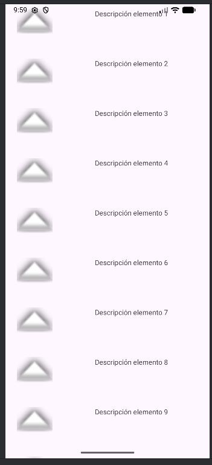

# RecyclerView

Pequeño proyecto de ejemplo que muestra cómo implementar un **RecyclerView** en Android utilizando Kotlin, un adaptador personalizado y un layout sencillo para cada elemento de la lista.

## Funcionalidad
- Lista de 20 elementos generados dinámicamente.
- Cada tarjeta incluye un icono y una descripción.
- Al pulsar un elemento, aparece un **Toast** indicando cuál has seleccionado.

## Captura del emulador

## Estructura principal
- `MainActivity.kt` → Configura el RecyclerView, dataset y eventos de click.  
- `DataAdapter.kt` → Adaptador personalizado con ViewHolder.  
- `ItemViewModel.kt` → Modelo de datos para cada elemento.  
- `item_layout.xml` → Diseño de cada tarjeta en la lista.  
- `activity_main.xml` → Contenedor principal con el RecyclerView.
